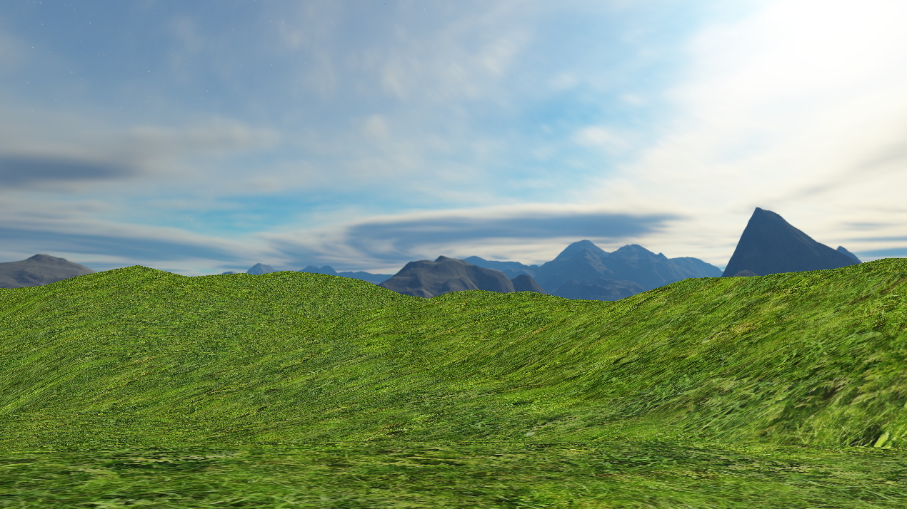

# World-101110011



Group project with OpenGL in C++.

    COMP 371
    Concordia University
    Winter 2017

## Roadmap

- Seva
    - ~~Project architecture~~
        - ~~Makefile~~
        - ~~Window class~~
        - ~~Shader class~~
        - ~~Camera class~~
        - ~~World class~~
        - ~~Abstract Mesh class~~
        - ~~Render modes~~
    - ~~Floating Camera controls~~
    - ~~Procedurally generated terrain~~
        - ~~Grid~~
        - ~~Terrain height generation~~
        - ~~Recursion on grid & terrain generation~~
        - ~~Texture~~
    - ~~Ambiance~~
        - ~~Sound engine~~
    - ~~Compiling (Linux & OSX)~~
        - ~~World with Terrain~~
        - ~~Trees~~
        - ~~Particles~~
    - ~~Documentation~~
        - ~~REAMDE~~
        - ~~Doxyfile to generate Doxygen~~
        - ~~Doxygen: class headers, methods & attributes of my classes~~
        - ~~Final report: Overview, Architecture, Terrain & Ambiance Sound~~
    - Optional
        - Infinite terrain, see: terrain-infinite branch
    
- Tarik
    - ~~Add Skybox~~ 
    - Add a day/night cycle to Skybox.
    - Add Terrain collision detection
    - Add tree collision detection
    - ~~(Optional) Add mini HUD~~

- Eric
    - Particles
        - Falling
        - Cloud

- Sami
    - Generating objects
        - L-System

- Justin
    - Shadows

- Not assigned
    - Illumination
    - Mountains shadows
    - Draw pointing arrows on axes + toggle it with a key
    - Water under certain elevation level
        - Reflection
    - Grass (multiple instantiations)
        - Wind influence

## Controls

**Basic:**

    ESC                     exit
    
    i                       zoom in
    o                       zoom out
    scroll                  zoom in / out
    
    w                       move forward
    s                       move backward
    a                       move left
    d                       move right
    
    mouse + left click     look around
    
**Extra:**

    arrows      rotate everything

    t           display triangles
    l           display lines
    p           display points

## Setup

**OSX**

    make mac

**Arch Linux**

Dependencies: ```glew glm glfw-x11 mesa-demos soil```

    make arch

**GNU / Linux**

    make linux

## Libraries

- SOIL : loads texture image
- SFML : sound engine
- FreeType : loading fonts

## Assets

- Textures

    - Terrain
    
        https://opengameart.org/content/terrain-textures-pack-from-stunt-rally-23

    - Skybox

        http://www.custommapmakers.org/skyboxes.php

- Sound
    
    - Background

        ```assets/sound/amb-forest.ogg```

        The size was reduced using Audacity software.

        http://www.freesound.org/people/bajko/sounds/385280

- Code
    
    A vital ressource to the project and learning to implement
    OpenGL concepts was [LearnOpenGL](https://learnopengl.com). It also helped with the implementation of our Shader, Skybox and GUI classes. 

## Documentation

Look into ```docs/``` folder; generate code documentation using ```doxygen``` command at project root.

## Coding Style

- Identation:

    It's a standard to use spaces over tabs. For readability, we recommend 4 spaces which is a widely used standard.

## Authors

| Name                   |  Email                       |
|:----------------------:|:----------------------------:|
| Tarik Abou-Saddik      | tarik.abousaddik@gmail.com   |
| Vsevolod (Seva) Ivanov | seva@tumahn.net              |
| Eric                   | ericchiassonmorgan@gmail.com |
| Sami					 | Sami@boubaker.me			    |
| Justin                 | zigman32@gmail.com           |
